# Money Insight - Architecture Documentation

Personal finance tracking app with offline-first sync. Runs as standalone web app, embedded in glean-oak-app via Shadow DOM, or as Tauri desktop app. Turborepo monorepo with shared UI package.

## System Overview

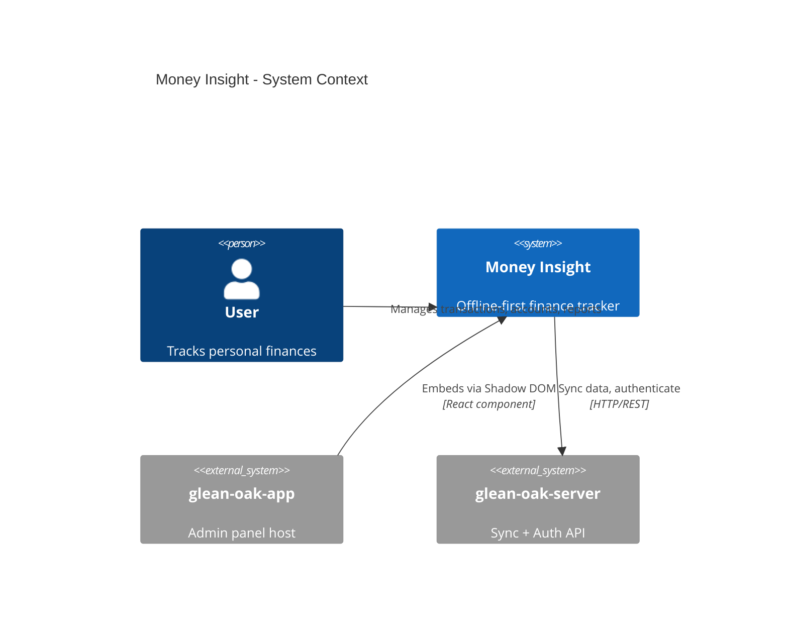

## Monorepo Structure

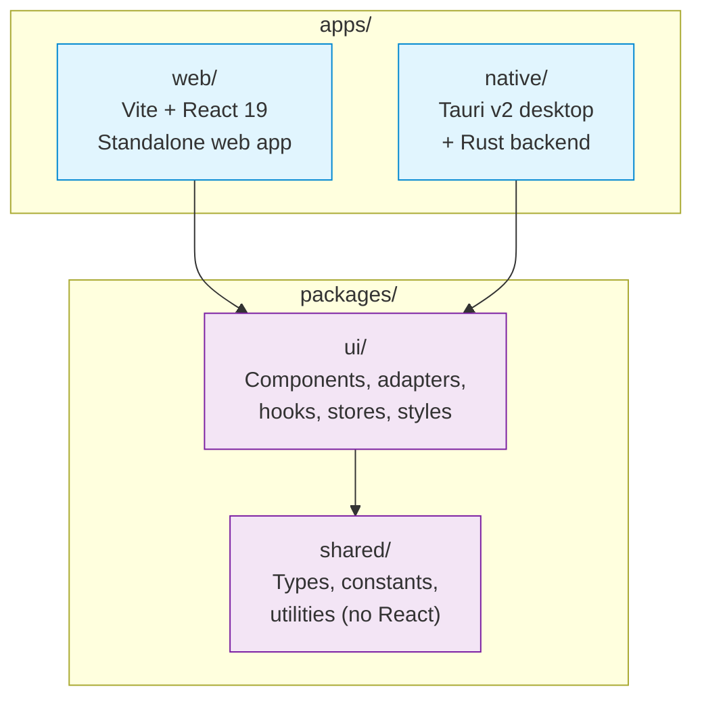

## Service Architecture

Services are injected via `ServiceFactory` using setter/getter functions. Platform detection (`isTauri()`) determines which adapter implementations to use.

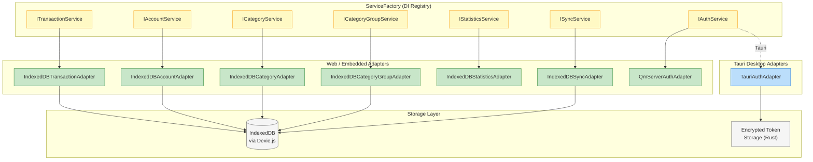

**Key files:**
- `packages/ui/src/adapters/factory/ServiceFactory.ts` - DI registry
- `packages/ui/src/adapters/web/` - IndexedDB implementations
- `packages/ui/src/adapters/shared/QmServerAuthAdapter.ts` - HTTP auth
- `packages/ui/src/adapters/tauri/TauriAuthAdapter.ts` - IPC auth

## Data Model

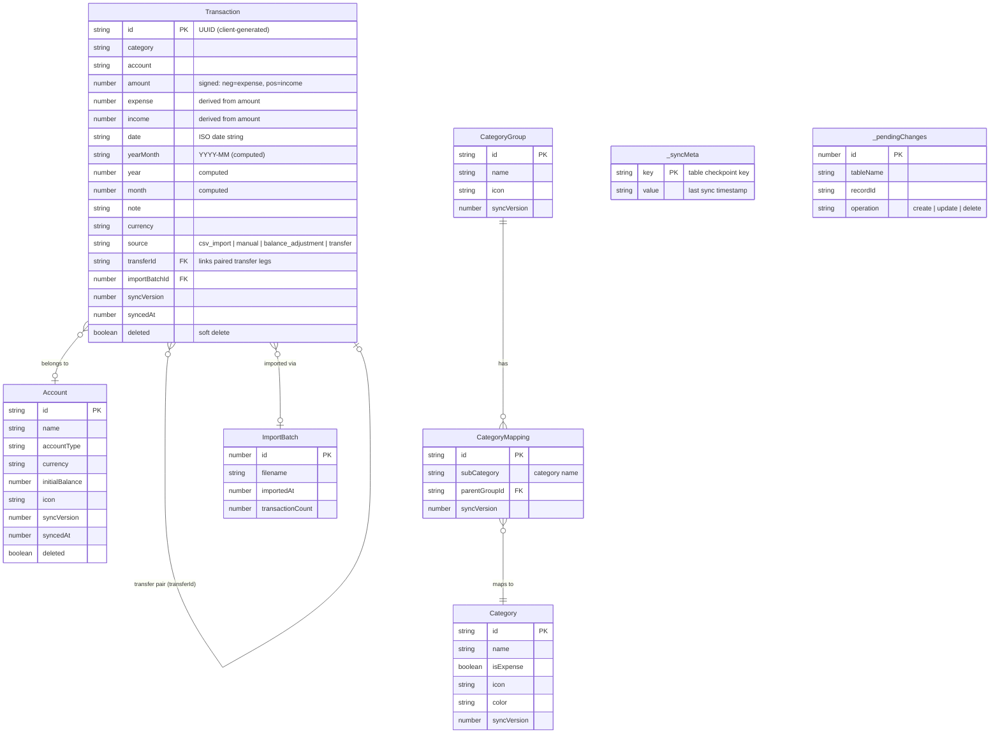

**Database:** Per-user IndexedDB via Dexie.js. DB name derived from hashed userId.

**Key file:** `packages/ui/src/adapters/web/database.ts`

## State Management

Two Zustand stores manage all client state.

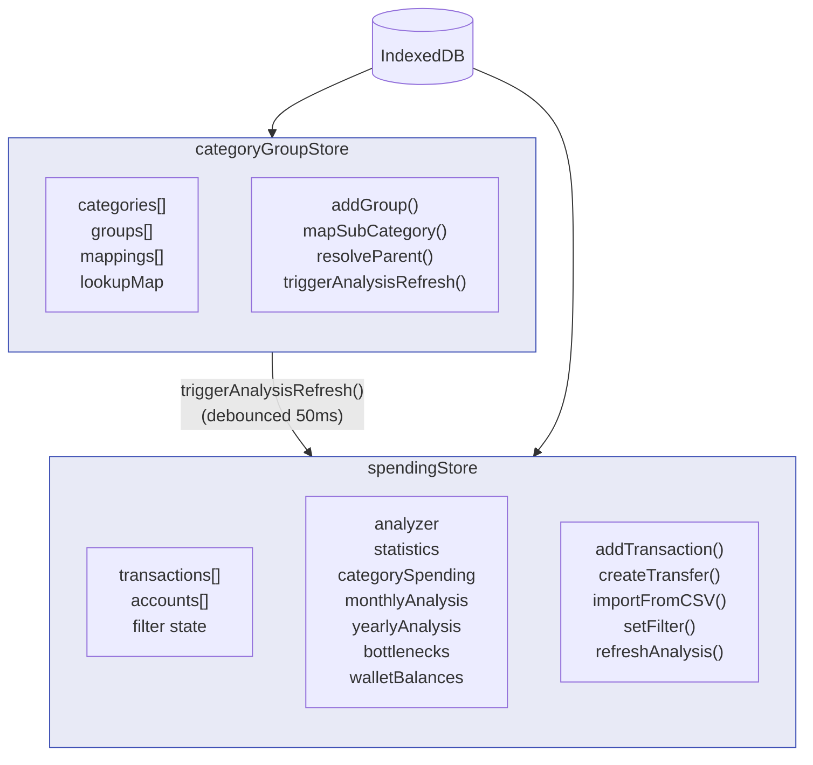

**Key files:**
- `packages/ui/src/stores/spendingStore.ts` - Transactions + analytics
- `packages/ui/src/stores/categoryGroupStore.ts` - Category hierarchy

## Component Architecture (Atomic Design)

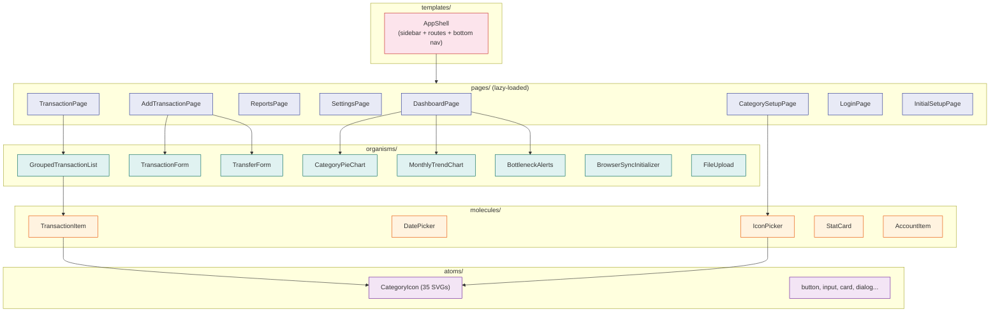

**Routes** (`packages/ui/src/components/pages/routes.tsx`):

| Path | Page | Description |
|------|------|-------------|
| `/dashboard` | DashboardPage | Charts, stats, recent transactions |
| `/transactions` | TransactionPage | Full transaction list + filters |
| `/add` | AddTransactionPage | Manual entry / transfer |
| `/reports` | ReportsPage | Analytics + reports |
| `/settings` | SettingsPage | Accounts, sync, preferences |
| `/categories` | CategorySetupPage | Category groups + icons |
| `/setup` | InitialSetupPage | First-run onboarding |

## Data Flows

### Transaction Creation

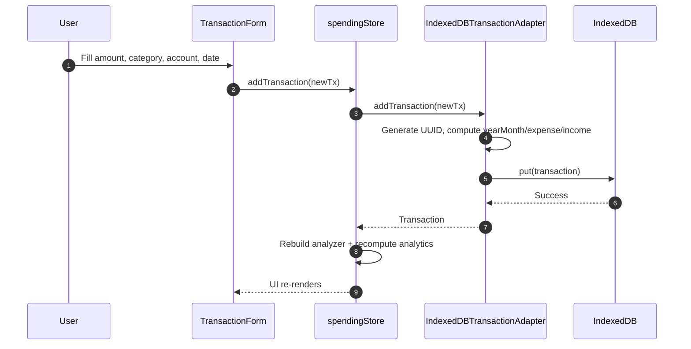

### Transfer Flow

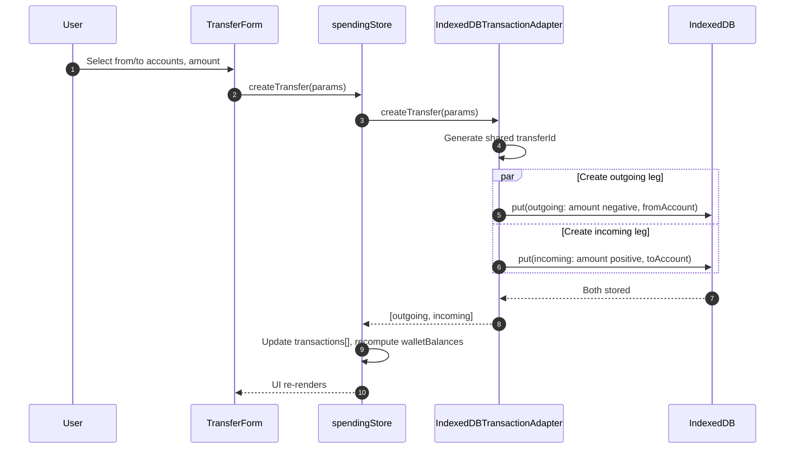

### Sync Flow

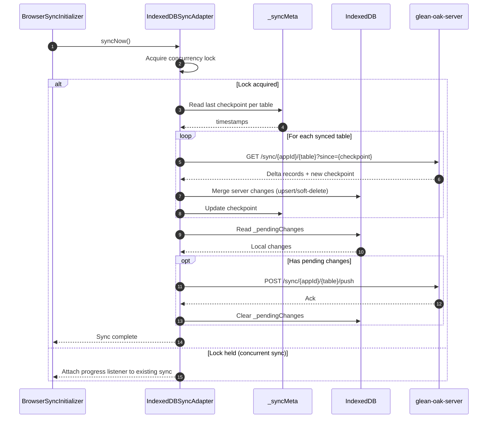

### Category Icon Resolution

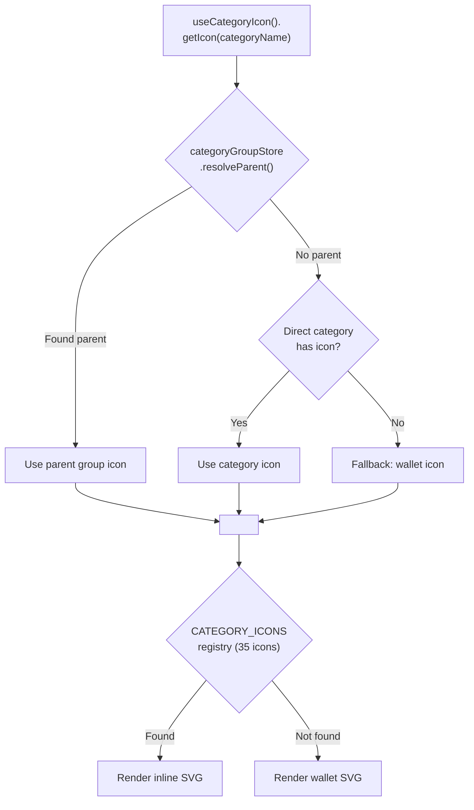

## Platform Deployment Modes

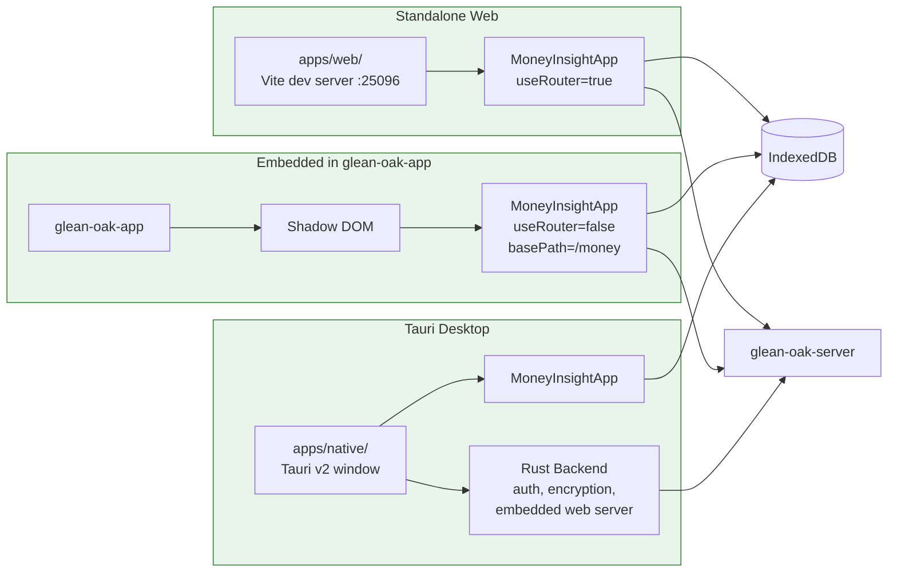

## Tauri/Rust Backend (Desktop)

The Rust backend is minimal -- only provides native platform features. All data operations remain in JavaScript/IndexedDB.

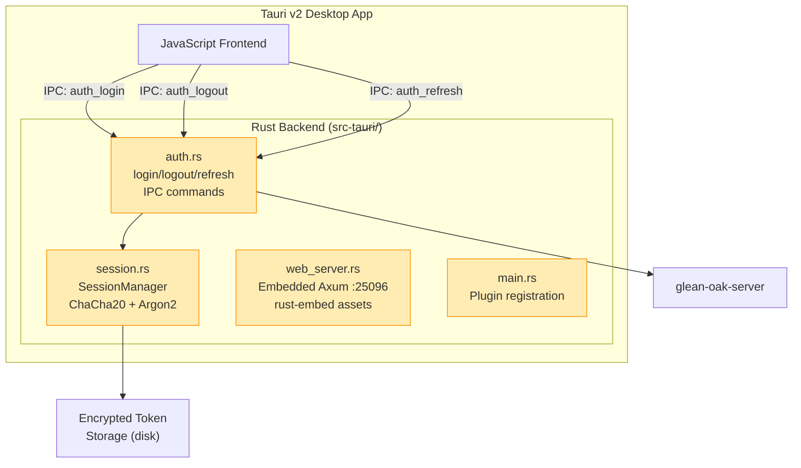

**Key files:**
- `apps/native/src-tauri/src/auth.rs` - Auth IPC commands
- `apps/native/src-tauri/src/session.rs` - Encryption (ChaCha20Poly1305 + machine-ID key)
- `apps/native/src-tauri/src/web_server.rs` - Embedded Axum server for browser mode

## Theme System

Three themes (light, dark, cyber) applied via CSS class on root element. CSS variables provide theming -- **not** Tailwind's `dark:` prefix.

| Variable | Light | Dark | Cyber |
|----------|-------|------|-------|
| `--color-bg-light` | `#f8f9fa` | `#0f172a` | `#0F172A` |
| `--color-bg-white` | `#ffffff` | `#1e293b` | `#1E293B` |
| `--color-text-primary` | `#111827` | `#f1f5f9` | `#F1F5F9` |
| `--color-primary-500` | `#635bff` | `#818cf8` | `#3B82F6` |
| `--font-family-heading` | Poppins | Poppins | JetBrains Mono |
| `--font-family-body` | Open Sans | Open Sans | JetBrains Mono |

**Key file:** `packages/ui/src/styles/global.css`

## Sync Architecture

| Concept | Implementation |
|---------|---------------|
| Local storage | IndexedDB (Dexie.js), per-user DB |
| Sync protocol | Checkpoint-based pagination |
| ID generation | Client-generated UUIDs (offline-capable) |
| Conflict resolution | Server-wins, version numbers |
| Soft delete | `deleted=true` + 60-day TTL |
| Concurrency | `_syncInFlight` lock, progress fan-out |
| Auth | Dual: API key (app identity) + JWT (user) |
| Metadata | `_syncMeta` (checkpoints) + `_pendingChanges` (outbox) |
